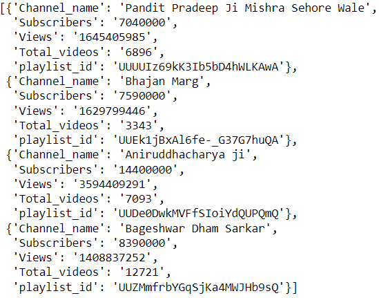
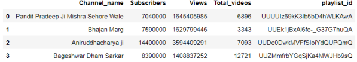
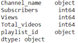
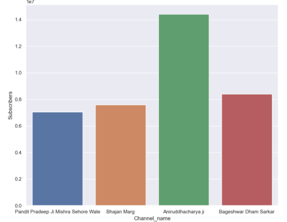
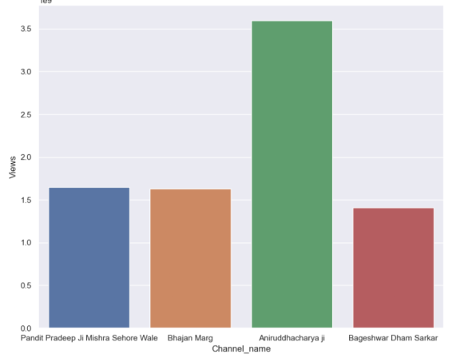
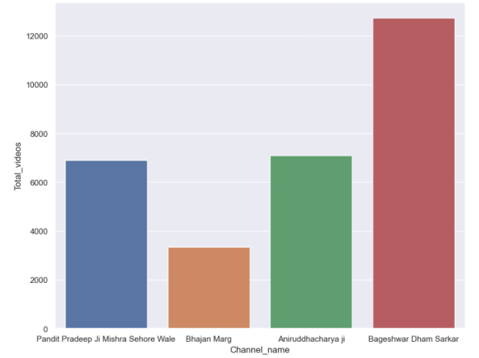
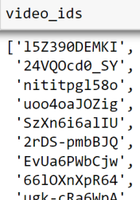

# Youtube Data Scraping and Analysis

## Introduction

This project is designed to scrape data from YouTube channels using the YouTube Data API, load it into a Pandas DataFrame for analysis, and create visualizations using the Seaborn library. The aim is to provide insights into the performance of specific YouTube channels, such as Bhajan Marg, Bagheshwar Dham, Pradeep Mishra, and Aniruddhacharya Ji.

## Project Overview

 - Data Extraction: Using the YouTube Data API, I extract key metrics from channels like Bhajan 
   Marg, Bagheshwar Dham, Pradeep Mishra, and Aniruddhacharya Ji. This includes video titles, 
   views, likes, comments, and more.

 - Data Loading: The extracted data is loaded into a Pandas DataFrame for easy manipulation and 
   analysis.

 - Data Analysis: Using Pandas, I perform various data analysis tasks to gain insights into the 
   content and engagement of these channels.

 - Data Visualization: I utilize Seaborn to create visualizations that help in understanding 
   trends and patterns in the data from these channels.

## Features

- Youtube Data Extraction:
  
     - The project utilizes the **google-api-python-client** library to interact with the 
       YouTube Data API.
     - Then create a youtube service using channel IDs of channels "Bhajan Marg", 
       "Aniruddhacharya ji", "PradeepMishra", "BagheswarDham".
     - Then create a function to get the channel statistics of each channel.

       

- Data Handling and Conversion:

     - The extracted data is loaded into a Pandas DataFrame for easy manipulation and analysis.
       
       
       
     - Convert relevant columns to numeric types to facilitate accurate analysis and computations.
       
       

- Visualizations:

     - Created 3 bargraphs consisting of subscribers per channel, views per channel and total videos per channel.

         - subscribers per channel
           
            
           
         - views per channel
           
            
           
         - total videos per channel
           
            

- Data retrieval and video ids extraction:
  
     - Using the loc method to get playlist ID of channel name "Bhajan Marg"

     - Create a function to get all videoIDs of "Bhajan Marg" using its playlistID.
 
     - retrieved all videoIDs of channel name "Bhajan Marg".

       

- Video details extraction:

     - Retrieve detailed statistics for each video, including title, published date, views, likes, and comments.
       
     - Process video details in batches to handle large numbers of videos efficiently.

- Data Post-Processing and Translation:

     - Convert video details into a DataFrame and process date and numeric columns for accurate representation.

     - Retrieve and display the top 10 videos based on views, and translate video titles from Hindi to English.

       

- Video views visualization:

     - Creating a horizontal bar plot to visualize the number of views for each video. This helps in identifying the most viewed videos.

       

                 

       
  
  
